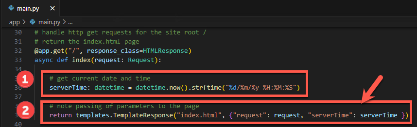
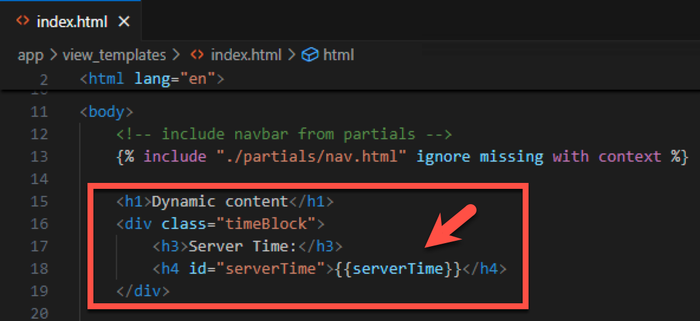
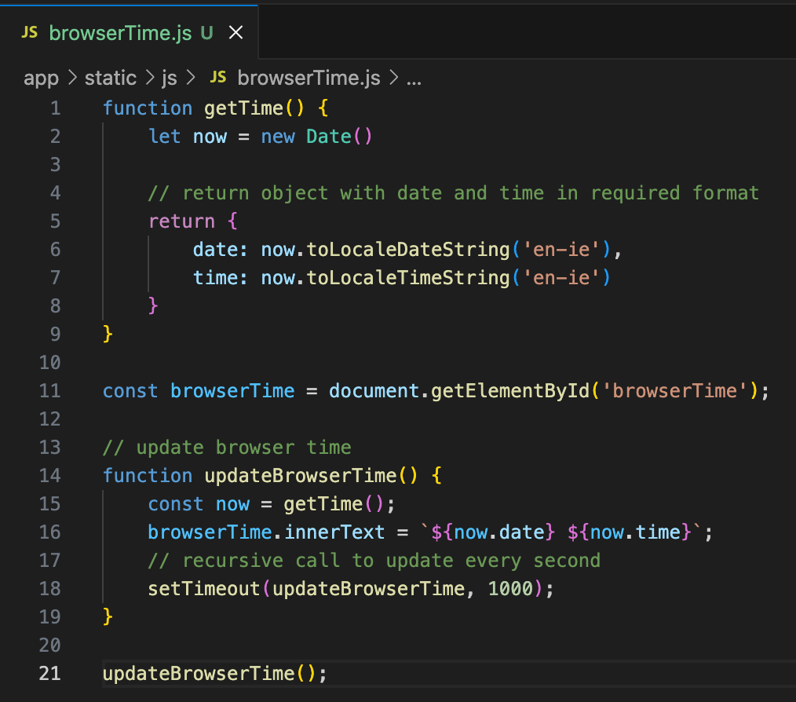
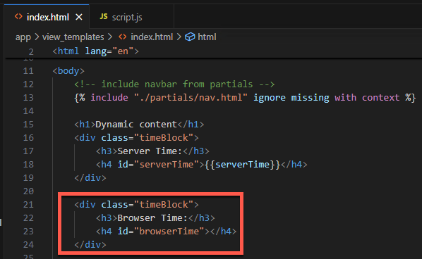
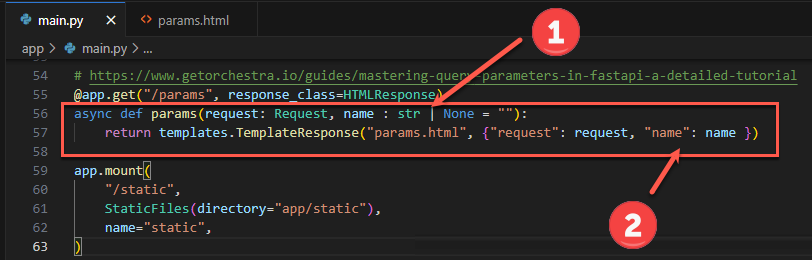
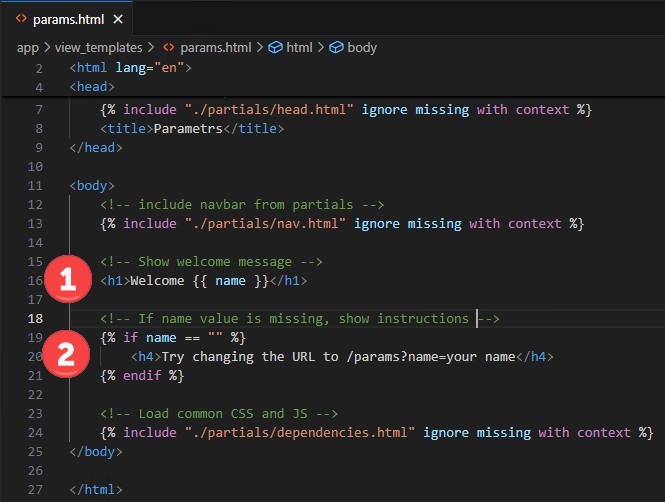
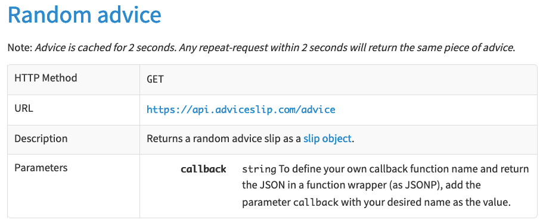
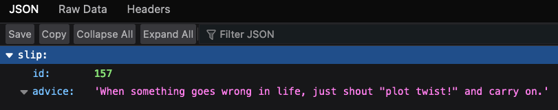
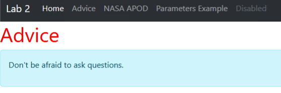
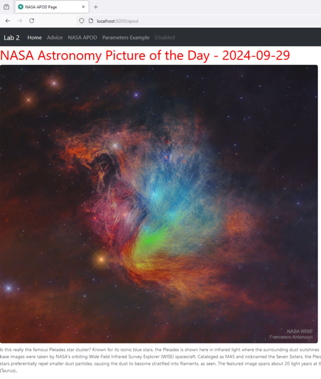

[](https://classroom.github.com/a/eU3jXNbW)
# Lab 3: Server-side Dynamic Content


## Introduction

In this lab you will build a server-side web application which genersates psages with dynamic content.

## 1. Setting Up

1. Configure the Python Virtual Environment

   `python -m venv venv --prompt="lab3"`

2. Activate the Virtual Environment

   `venv\Scripts\activate`

3. Install dependencies

   `pip install fastapi uvicorn['standard'] jinja2 python-multipart httpx`

4. Add `main.py` to the app folder, with the starter code from lab 1:

```python
# import dependencies
from fastapi import FastAPI, Request
from fastapi.responses import HTMLResponse
from fastapi.staticfiles import StaticFiles
from fastapi.templating import Jinja2Templates

# create app instance
app = FastAPI()

# set location for templates
templates = Jinja2Templates(directory="app/view_templates")

# handle http get requests for the site root /
# return the index.html page
@app.get("/", response_class=HTMLResponse)
async def index(request: Request):
    return templates.TemplateResponse("index.html", {"request": request})

app.mount(
    "/static",
    StaticFiles(directory="app/static"),
    name="static",
)
```

5. Run the application on TCP port 5000
   ```bash
   uvicorn app.main:app --reload --port=5000
   ```

## 2. Add site pages

Add `index.html` with some  sample text, then run the application to make sure the page loads.

The add the following pages with some placeholder text in each:

1. **`advice.html`**
2. **`apod.html`**
3. **`params.html`**

### 2.1. Add a shared Navigation menu and other shared content.

Keeping a navigation menu up to date across individual pages is time consuming and error prone. The Jinja templating system we are using make it easy to share common content.

1. Add a new page, **`nav.html`** to `app/view_templates/partials`. We will use the partials folder for shared content and page components.

   Define your navigation menu in `nav.html` using this code to create a Bootstrap based navbar. Notice that it is not a complete page and does not need the usual `<html>` and `<body>` elements.

   ```html
   <nav class="navbar navbar-expand-lg bg-body-tertiary" data-bs-theme="dark">
       <div class="container-fluid">
           <a class="navbar-brand" href="#">Lab 2</a>
           <button class="navbar-toggler" type="button" data-bs-toggle="collapse" data-bs-target="#navbarNavAltMarkup"
               aria-controls="navbarNavAltMarkup" aria-expanded="false" aria-label="Toggle navigation">
               <span class="navbar-toggler-icon"></span>
           </button>
           <div class="collapse navbar-collapse" id="navbarNavAltMarkup">
               <div class="navbar-nav">
                   <a class="nav-link active" aria-current="page" href="/">Home</a>
                   <a class="nav-link" href="/advice">Advice</a>
                   <a class="nav-link" href="/apod">NASA APOD</a>
                   <a class="nav-link" href="/params">Parameters Example</a>
                   <a class="nav-link disabled" aria-disabled="true">Disabled</a>
               </div>
           </div>
       </div>
   </nav>
   ```

   

2. Add a new page, **`dependencies.html`** to `app/view_templates/partials`. This one will be used to for any CSS and JavaScript dependencies.

   The latest Bootstrap CDN links can ge found at https://www.bootstrapcdn.com/

   ```html
   <!-- Bootstrap -->
   <link rel="stylesheet" href="https://cdn.jsdelivr.net/npm/bootstrap@5.3.3/dist/css/bootstrap.min.css"
       integrity="sha384-QWTKZyjpPEjISv5WaRU9OFeRpok6YctnYmDr5pNlyT2bRjXh0JMhjY6hW+ALEwIH" crossorigin="anonymous">
   <script src="https://cdn.jsdelivr.net/npm/bootstrap@5.3.3/dist/js/bootstrap.bundle.min.js"
       integrity="sha384-YvpcrYf0tY3lHB60NNkmXc5s9fDVZLESaAA55NDzOxhy9GkcIdslK1eN7N6jIeHz"
       crossorigin="anonymous"></script>
   
   <!-- app css and JS -->
   <link rel="stylesheet" href="/static/css/style.css">
   <script src="/static/js/script.js"></script>
   ```

   

3. Finally, aadd **`head.html`** to `app/view_templates/partials`. This one will be used to for common content in the `<head>` sections of our pages.

   ```html
   <link id="favicon" rel="icon" type="image/x-icon" href="/static/images/favicon.ico">
   ```

Now the partial files can be included in each page template as required. For example, **`index.html`**:

```jinja2
<!DOCTYPE html>
<html lang="en">

<head>
    <meta charset="UTF-8">
    <meta name="viewport" content="width=device-width, initial-scale=1.0">
  	<!-- Load common head content, including the favicon link -->
    
    <title>Home Page</title>
</head>

<body>
    <!-- include navbar from partials -->
    

    <h1>Dynamic content Examples</h1>

    <!-- Load common CSS and JS -->
    
</body>

</html>
```

### 2.2. Exercices

1. Add the shared nav menu and other partials to all pages in the site.

2. Add routes in **`app/main.py`** for the full pages (but not the partials).

   

## 3. Dynamic content example 1

Lab 1 showed how to host a static site. The pages in this site always displayed the same content and did not change between requests. In this example you will create a page which shows different content each time it is loaded.

### 3.1. Generating content on the server-side

This is a simple example which will insert the current date and time when the page is generated.

1. Start by opening **`app/main.py`** 

2. The Python `datetime` package is required, import it at the top using -

   `from datetime import datetime`

3. We will need to get the current date and time whenever the home page is requested - so in the function which handles requests for the site root, **`/`**

   1. First use a variable, `serverTime` to store the generated date in the required format.
   2. Then include `serverTime` as a parameter when returning the `TemplateResponse()`

   

### 3.2. Display `serverTime` in index.html

Earlier we included an external nav menu in  `index.html`, making use of `Jinja`. Now we can use another feature to add the `serverTime` value to the page, using some more Jinja templating syntax -

```jinja2
{{ serverTime }}
```

The CSS is already defined in `stlye.css`. Add the content below to your page:



**Save** the page and load the application in a browser, the time should be displayed.

### 3.3. Generating dynamic content on the client-side

Any content generated in the browser is client-side. This is usually achieved via JavaScript or WebAssembly. 

This example will use JavaScript to compare server and client side generated content.

**`/static/js/browserTime.js`** contains the `getTime()` and `updateBrowserTime()`functions which will be used to display a realtime clock in the index.html. Use a `script` element to add this script to `index.html`. This script was not included in the `dependencies.html` partial as it only applies to this page.



### 3.4. Display client-side browserTime

Add the highlighed HTML to `index.html` to display the JS generated client-side clock



Now save the file and load the site in your browser to compare the client and server generated content. The client-side clock is updated each second **but how do you update server time?**


## 4. Dynamic content example 2

This example demonstrates how to create dynamic content based on query parameters, i.e. passed via the URL.

The `/params` route route will be used to pass a value, `name`, to the `params.html` template. For example `/params?name=Bob` sets the value of paramater `name` to value `Bob`.

### 4.1. Modify the `/params` route to accept the `name` parameter

1. First modify the function which handles requests for `/param` to read the `name` param. This reads name or sets the value `= ""` if missing. The ` : str` part indicates the required type, see 

   ```python
   name : str | None = ""
   ```

2. The function returns the name value , `"name" : name`, to the `params.html` template. 




### 4.2 Modify `params.html` to display the value of `name`

1. As it was passed to the template, the value of `name` cane be displayed using `{{ name }}`
2. The if block,  starting with ` ` , is used to display instructions in case the `name` value is missing.



Save your files and try it out, `/params?name=value` should show a greeting with the value entered.

 

## 5. Getting Content from a web API

### 5.1. Introduction

This section demonstrates how to get data from an external; source and include it in a page - as another example of dynamic content.

Think of web API as an web application which returns data instead of the usual HTML. This data is intended for further processing and not intended for consumption by humans. APIs exist for many purposes including weather forecasts, sports results, financial services, cloud service monitoring, news headlines, music and movie data, etc.

Some are paid for services while others are free. Some are public, sme require registration and authentication via n API key.

Usually APIs are 'rate limited' to avoid over usage and denial of service attacks so don't make too many unnecessary requests.

The data returned by an API is usually in a standard 'machine readable' format such as `XML` (e**X**tensible **M**arkup **L**anguage) or `JSON` (**J**ava**S**cript **O**bject **N**otation). JSON is most common as it is lightweight and easy to work with.

### 5.2. The Advice Slip API

In this example we will use a free public API called **[Advice Slip JSON API](https://api.adviceslip.com/)**. According the the [API documentaton](https://api.adviceslip.com/), it returns a random **Advice Slip** as JSON when requested. The documentation shows the ways in which the API can be called via its `endpoints`. 

Here are the details for using the Random advice endpoint:



To get some advice, enter the URL above in a browser. It should return a JSON object, similar to:

```json
{"slip": { "id": 157, "advice": "When something goes wrong in life, just shout \"plot twist!\" and carry on."}}
```

JSON follows strict syntax rules and is made up of `"name": value` pair objects. In this example the data value of the  `"slip"` object is made up of another object `{"id": 175, "advice": "advice value..."}`

Think of this as an hierarchy so that advice can be accessed using `JSON_data.slip.advice`.



### 5.3 Accessing the API via Python

#### 5.3.1. Managing secrets, links, etc.

In this step you will use Python to load the JSON data for the API so that it can be used in a web page. This will require the use of an exaternal URL and optionally, an API key.

**Hard-coding values such as URLs and API keys is a really bad idea as that could allow attackers to access  access credentials amd other secrets.** Many hacks and attacks have been made possible by including secrets in scripts and code which ends up on a public code repository on GitHub, etc.

A safer option is to use **environment variables** which can be kept secure by the Operating System when the application is deployed. During development, this can be managed using a **`.env`** file in the root of the application.

The starter repo contains a file named `.env.example`. copy this file as `.env` and keep a copy as this file will not be pushed to GitHub (due to a rule in the `.gitignore` file).

**.env** should contain the following for now:

```bash
ADVICE_URL="https://api.adviceslip.com/advice"

NASA_API_KEY=""
NASA_APOD_URL="https://api.nasa.gov/planetary/apod?api_key="
```

The NASA parts are for later, for now we need the **`ADVICE_URL`**

 #### 5.3.2. Adding Dependencies, etc.

Open `app/main.py` and add the following dependencies after the existing ones. The last defines a `config` object to manage our environment variables.

```python
import httpx
from contextlib import asynccontextmanager
import json
from starlette.config import Config

# Load environment variables from .env
config = Config(".env")

```

We also need a way to access the API from our code. Add the following just after the imports and modify the exising `app = FastAPI()` as shown. This will add the ability to make Asynchronous requsts to APIs, etc. (Don't worry about the details of this for now!)

**This requires the latest Python release, version 3.12.x**

```python
@asynccontextmanager
async def lifespan(app: FastAPI):
    app.requests_client = httpx.AsyncClient()
    yield
    await app.requests_client.aclose()


# create app instance
app = FastAPI(lifespan=lifespan)
```

Now we have defined a `request _client` which can be used to get data from the API.

#### 5.3.3. Getting data in the `/advice`  handler

Now modify (or add) the `/advice` route handler function in `app/main.py`. This code does the following:

1. define a client to make the request
2. make the request and assign the response to `response`
3. Send the JSON data from `response` to the page template. 

```python
@app.get("/advice", response_class=HTMLResponse)
async def advice(request: Request):
    
    # Define a request_client instance
    requests_client = request.app.requests_client

    # Connect to the API URL and await the response
    response = await requests_client.get(config("ADVICE_URL"))

    # Send the json data from the response in the TemplateResponse data parameter 
    return templates.TemplateResponse("advice.html", {"request": request, "data": response.json() })
```

#### 5.3.4 Add the advice message to `advice.html`

The JSON data (see 5.2 above) can now be accessed in the page template via the `data` object. to get the advice value use: `data.slip.advice` in the page. For example, with Bootstrap styling:

```html
   <h1>Advice</h1>
    <div class="alert alert-info" role="alert">
        <p>{{ data.slip.advice }}</p>
    </div>
```

 The result should display something like this:



## 6. Exercise - NASA Astronomical Picture of the Day

NASA provides a number of public APIs including the APOD which returns the Astronomical Picture of the Day. The APIs are free to use but require an API Key which can be obtained via this link **https://api.nasa.gov/** . After recieving your key, add it to the `.env` file.

1. The API URL is **`https://api.nasa.gov/planetary/apod?api_key=`**. You will need to append your own key to the end of this URL when making the request in Python, e.g.

   ```python
   response = await requests_client.get(config("NASA_APOD_URL") + config("NASA_API_KEY"))
   ```

   

2. The API returns the picture as JSON, including values for  `date`, `explanation`, and `url`, for example:

   ```json
   {"date":"2024-09-29",
    "explanation":"Is this really the famous Pleiades star cluster? Known for its iconic blue stars, the Pleiades is shown here in infrared light where the surrounding dust outshines the stars. Here, three infrared colors have been mapped into visual colors (R=24, G=12, B=4.6 microns). The base images were taken by NASA's orbiting Wide Field Infrared Survey Explorer (WISE) spacecraft. Cataloged as M45 and nicknamed the Seven Sisters, the Pleiades star cluster is by chance situated in a passing dust cloud. The light and winds from the massive Pleiades stars preferentially repel smaller dust particles, causing the dust to become stratified into filaments, as seen. The featured image spans about 20 light years at the distance of the Pleiades, which lies about 450 light years distant toward the constellation of the Bull (Taurus).",
    "hdurl":"https://apod.nasa.gov/apod/image/2409/Pleiades_WiseAntonucci_5000.jpg",
    "media_type":"image","service_version":"v1","title":"Seven Dusty Sisters",
    "url":"https://apod.nasa.gov/apod/image/2409/Pleiades_WiseAntonucci_960.jpg"}
   
   ```

​	Read the [**API Documentation**](https://api.nasa.gov/#apod) for full details.


**The execise is to display this data in the Lab 2 NASA APOD page so that it looks something like this:**



Image source: NASA, https://apod.nasa.gov/apod/


Once complete, push your finished lab to your GitHub Classroom Repo for Lab 3.


